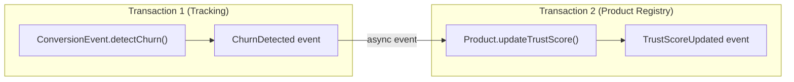
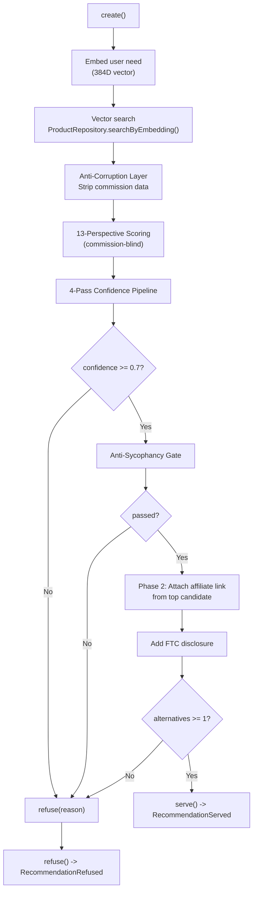
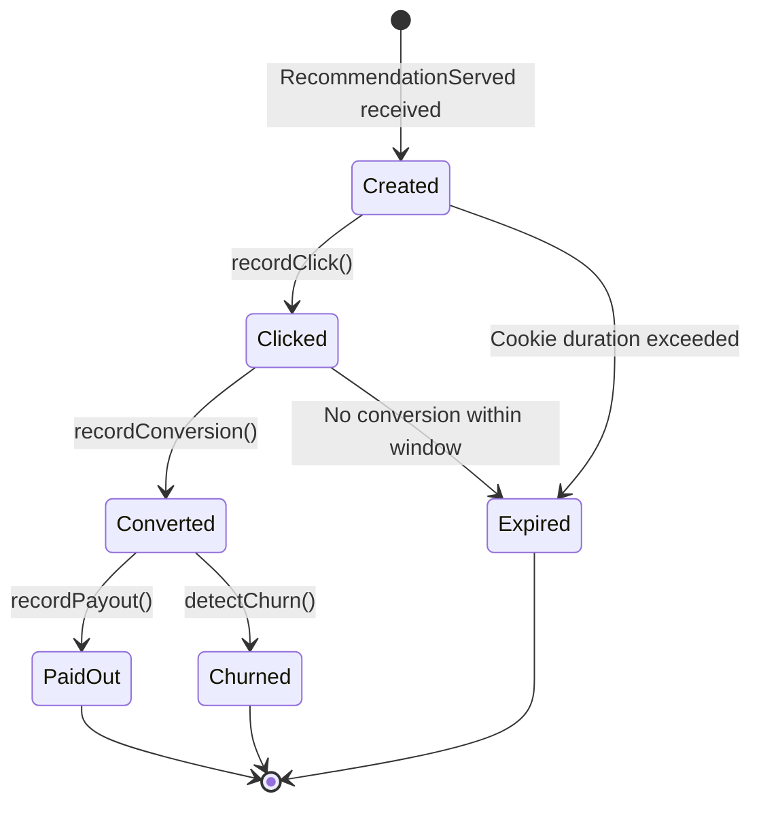
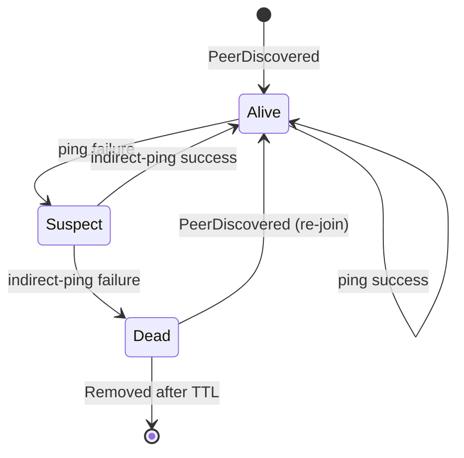
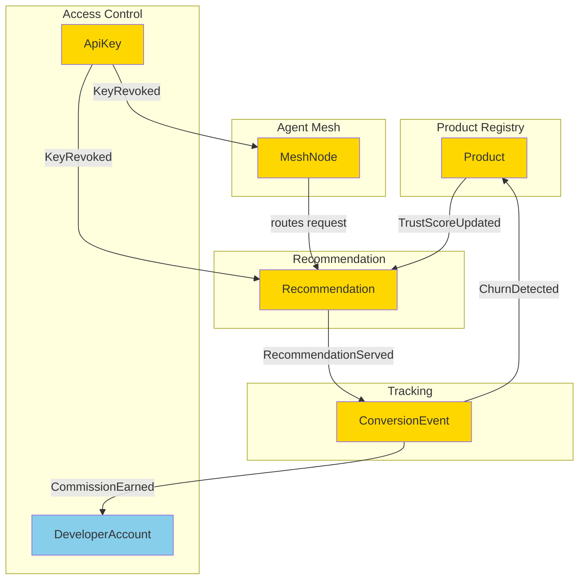

# AAN Aggregate Design

This document specifies the invariants, commands, events, and transaction boundaries for each aggregate root in the Agent Affiliate Network.

---

## Design Principles

1. **Small aggregates.** Each aggregate protects a minimal consistency boundary. Cross-aggregate consistency is eventual, mediated by domain events.
2. **Reference by identity.** Aggregates reference other aggregates by ID, never by direct object reference.
3. **One transaction per aggregate.** A single database transaction modifies exactly one aggregate. If a command affects multiple aggregates, the first is updated synchronously and the rest are updated via domain events.
4. **Event-first.** Every state change emits a domain event. The Tracking context is fully event-sourced.

---

## 1. Product (Product Registry Context)

### Invariants

| # | Rule | Enforcement |
|---|------|-------------|
| P1 | A Product MUST have a valid 384-dimensional embedding before it can be activated. | Checked in `register()` and `activate()`. |
| P2 | A Product's Trust Score MUST be in the range [0, 1]. | Value object constructor enforces bounds. |
| P3 | A Product's Trust Score MUST be recalculated when a `ChurnDetected` event is received. | Event handler triggers `updateTrustScore()`. |
| P4 | A Product MUST have at least one active Affiliate Program to be recommendable. | Checked in `isRecommendable()` predicate. |
| P5 | A deactivated Product MUST NOT appear in vector search results. | Query filter: `WHERE active = true`. |

### Commands

```typescript
interface ProductCommands {
  // Register a new product with embedding and initial trust score
  register(data: {
    name: string;
    category: string;
    description: string;
    bestFor: string[];
    worstFor: string[];
    affiliatePrograms: AffiliateProgramData[];
  }): void;

  // Recalculate trust score from new signals
  updateTrustScore(signals: {
    reviews: number;        // 0-1
    retention: number;      // 0-1
    support: number;        // 0-1
    pricingTransparency: number;
    stability: number;
    devActivity: number;
    security: number;
    refundPolicy: number;
  }): void;

  // Change an affiliate link (program rotation, network change)
  changeAffiliateLink(programId: string, newLink: string): void;

  // Remove from active recommendations
  deactivate(reason: string): void;

  // Re-activate a previously deactivated product
  activate(): void;
}
```

### Events

| Event | Emitted By | Consumed By |
|-------|-----------|-------------|
| `ProductRegistered` | `register()` | Recommendation (cache invalidation) |
| `TrustScoreUpdated` | `updateTrustScore()` | Recommendation (re-rank if active query) |
| `AffiliateLinkChanged` | `changeAffiliateLink()` | Tracking (update active links) |
| `ProductDeactivated` | `deactivate()` | Recommendation (remove from candidates) |

### Transaction Boundary

One `Product` aggregate per transaction. The `updateTrustScore()` command is triggered by a `ChurnDetected` event from Tracking -- this is a separate transaction from the one that recorded the churn.



---

## 2. Recommendation (Recommendation Context)

### Invariants

| # | Rule | Enforcement |
|---|------|-------------|
| R1 | A Recommendation MUST have confidence >= 0.7 to be served. | `serve()` throws `InsufficientConfidenceError` if violated. |
| R2 | A Recommendation MUST include FTC disclosure text when served. | `serve()` generates disclosure and attaches it. Cannot transition to `served` without it. |
| R3 | Commission data MUST NOT be visible to Phase 1 scoring. | Structural: ACL strips `PayoutInfo` from candidates before scoring. Audit trail logs pre/post commission data. |
| R4 | A Recommendation that fails anti-sycophancy MUST be refused. | `serve()` checks `assessment.passedAntiSycophancy`. |
| R5 | A served Recommendation MUST include at least one alternative product. | `serve()` validates `alternativeIds.length >= 1`. |
| R6 | A Recommendation can only transition: `pending -> served` or `pending -> refused`. No other transitions allowed. | State machine in aggregate root. |

### Commands

```typescript
interface RecommendationCommands {
  // Create a new recommendation request
  create(data: {
    rawNeed: string;
    budget?: string;
    technicalLevel?: string;
    currentStack?: string[];
  }): void;

  // Attempt to serve the recommendation (runs full pipeline)
  serve(): void;

  // Refuse to recommend (confidence too low or anti-sycophancy failed)
  refuse(reason: string): void;
}
```

### The Recommendation Pipeline (inside `serve()`)



### Events

| Event | Emitted By | Consumed By |
|-------|-----------|-------------|
| `RecommendationRequested` | `create()` | Analytics (request volume tracking) |
| `RecommendationServed` | `serve()` | Tracking (create ConversionEvent), Analytics |
| `RecommendationRefused` | `refuse()` | Analytics (refusal rate monitoring) |

### Transaction Boundary

One `Recommendation` aggregate per transaction. The `create()` and `serve()`/`refuse()` calls may happen in the same request (synchronous pipeline) but are logically distinct commands. The `RecommendationServed` event triggers async creation of a `ConversionEvent` in the Tracking context.

---

## 3. ConversionEvent (Tracking Context)

### Invariants

| # | Rule | Enforcement |
|---|------|-------------|
| T1 | A ConversionEvent MUST be linked to a valid RecommendationId. | Constructor requires `sourceRecommendation`. |
| T2 | A Click MUST precede a Conversion. | State machine: click must exist before conversion can be recorded. |
| T3 | A Conversion MUST precede a CommissionPayout. | State machine: conversion must exist before payout can be recorded. |
| T4 | Revenue amounts MUST be positive. | `Revenue` value object constructor validates `amount > 0`. |
| T5 | A ConversionEvent is append-only (event-sourced). Events cannot be deleted or modified. | Event store with immutable entries. |

### Commands

```typescript
interface ConversionEventCommands {
  // Record that the affiliate link was clicked
  recordClick(data: {
    url: string;
    subAffiliateId: string;
    userAgent: string;
  }): void;

  // Record that the click converted to a signup/purchase
  recordConversion(data: {
    type: string;         // "signup" | "purchase" | "upgrade"
    revenue: Revenue;
  }): void;

  // Record that commission was paid out
  recordPayout(data: {
    amount: Revenue;
    network: string;
  }): void;

  // Detect and record churn
  detectChurn(): void;
}
```

### Events

| Event | Emitted By | Consumed By |
|-------|-----------|-------------|
| `LinkClicked` | `recordClick()` | Analytics (click tracking) |
| `ConversionRecorded` | `recordConversion()` | Analytics, Revenue dashboard |
| `CommissionEarned` | `recordPayout()` | Developer dashboard, Revenue reporting |
| `ChurnDetected` | `detectChurn()` | Product Registry (`Product.updateTrustScore()`) |

### Transaction Boundary

One `ConversionEvent` aggregate per transaction. This aggregate is fully event-sourced: its state is derived from the sequence of events (`LinkClicked` -> `ConversionRecorded` -> `CommissionEarned` or `ChurnDetected`).



---

## 4. MeshNode (Agent Mesh Context)

### Invariants

| # | Rule | Enforcement |
|---|------|-------------|
| M1 | A GossipMessage MUST be signed by the sending agent. | `gossip()` signs each message. `receivePeer()` verifies signature. Unsigned messages are dropped. |
| M2 | A Peer MUST be verified via proof-of-liveness before trust > 0.5. | `TrustEngine` caps trust at 0.5 until liveness is confirmed. |
| M3 | A MeshNode MUST NOT gossip more frequently than once per 25 seconds (30s - max jitter). | Rate limiter in `GossipEngine`. |
| M4 | A Peer that fails 3 consecutive liveness checks MUST be marked as dead. | Failure detection state machine: `alive -> suspect -> dead`. |
| M5 | Gossip messages MUST use delta exchange (only new/updated peers). | `gossip()` computes diff from last round. |
| M6 | A MeshNode's Skill Vector MUST be a valid 384-dimensional embedding. | Value object constructor validates dimensions. |

### Commands

```typescript
interface MeshNodeCommands {
  // Join the mesh using bootstrap peer endpoints
  joinMesh(bootstrapPeers: PeerEndpoint[]): void;

  // Perform one gossip round (called on timer)
  gossip(): GossipMessage[];

  // Process an incoming peer update from gossip
  receivePeer(peer: PeerInfo, signature: string): void;

  // Update this node's skill vector
  updateSkillVector(capabilities: string[]): void;

  // Report a successful conversion (deposit pheromone trail)
  reportConversion(productId: string): void;

  // Verify a peer's liveness
  pingPeer(peerId: PeerId): Promise<boolean>;
}
```

### Events

| Event | Emitted By | Consumed By |
|-------|-----------|-------------|
| `PeerDiscovered` | `receivePeer()` | SkillRouter (update routing table) |
| `PeerLost` | `pingPeer()` failure detection | SkillRouter (remove from routing), Analytics |
| `SkillPropagated` | `gossip()` | Other MeshNodes (via gossip) |
| `TrustScoreChanged` | `TrustEngine` | SkillRouter (weight routing by trust) |

### Transaction Boundary

One `MeshNode` aggregate per transaction. Gossip is fire-and-forget: a gossip round emits messages but does not wait for acknowledgment. Peer updates received from gossip are processed independently.

### Failure Detection State Machine



---

## 5. ApiKey (Access Control Context)

### Invariants

| # | Rule | Enforcement |
|---|------|-------------|
| A1 | An ApiKey MUST be associated with a valid DeveloperAccount. | Foreign key constraint + constructor validation. |
| A2 | A revoked ApiKey MUST NOT authenticate any requests. | `checkRateLimit()` returns false if `revokedAt` is set. |
| A3 | A DeveloperAccount's usage MUST NOT exceed their tier's rate limit. | `checkRateLimit()` validates against `Subscription.rateLimit`. |
| A4 | The plaintext API key MUST only be returned once (at creation time). | Only the hash is stored. The plaintext is returned in the `AccountCreated` response and never again. |
| A5 | A Tier downgrade MUST NOT occur while usage exceeds the lower tier's limits. | `downgrade()` checks current usage against target tier limits. |

### Commands

```typescript
interface ApiKeyCommands {
  // Create a new API key for an account
  create(accountId: DeveloperAccountId): { key: string; prefix: string };

  // Revoke an API key
  revoke(reason: string): void;

  // Check if a request is allowed under rate limits
  checkRateLimit(): RateLimitResult;
}

interface DeveloperAccountCommands {
  // Register a new developer account
  register(email: string): { account: DeveloperAccount; apiKey: string };

  // Upgrade to a higher tier
  upgrade(newTier: Tier): void;

  // Configure sub-affiliate settings
  configureSubAffiliate(config: SubAffiliateConfig): void;
}
```

### Events

| Event | Emitted By | Consumed By |
|-------|-----------|-------------|
| `AccountCreated` | `register()` | Welcome email, Analytics |
| `TierUpgraded` | `upgrade()` | Rate limiter (update limits), Analytics |
| `QuotaExceeded` | `checkRateLimit()` | Analytics (abuse detection), Alerting |
| `KeyRevoked` | `revoke()` | All contexts (invalidate cached auth) |

### Transaction Boundary

`ApiKey` and `DeveloperAccount` are separate aggregates that reference each other by ID. Creating an account and its first API key is a two-step process: (1) create account, (2) create key linked to account. Both happen in the same request but in separate transactions, with the account created first.

---

## Cross-Aggregate Event Flow

This diagram shows how domain events connect aggregates across bounded contexts:



Yellow nodes are aggregate roots. The arrows represent domain events flowing between aggregates across context boundaries. Every arrow is an asynchronous, eventually-consistent integration point.
