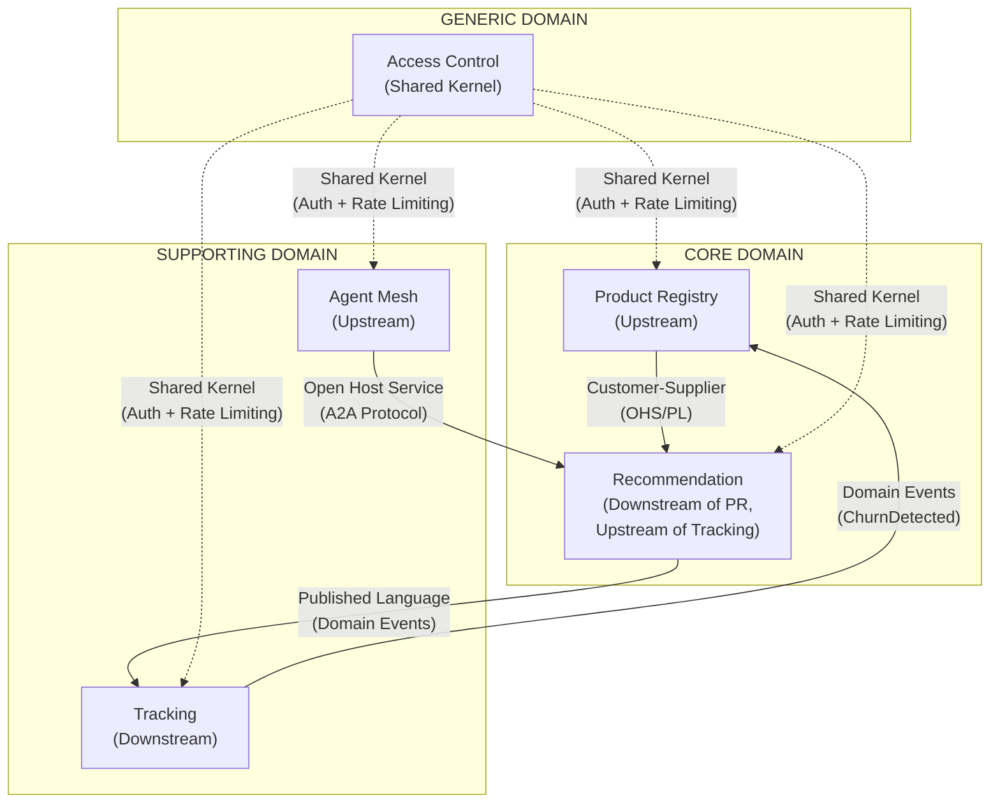
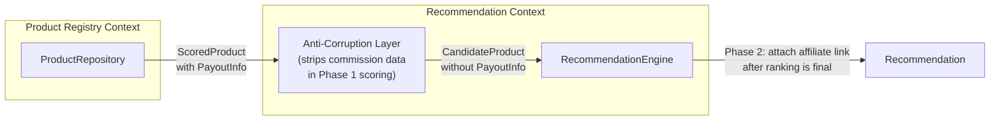
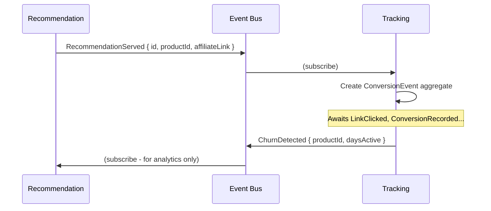
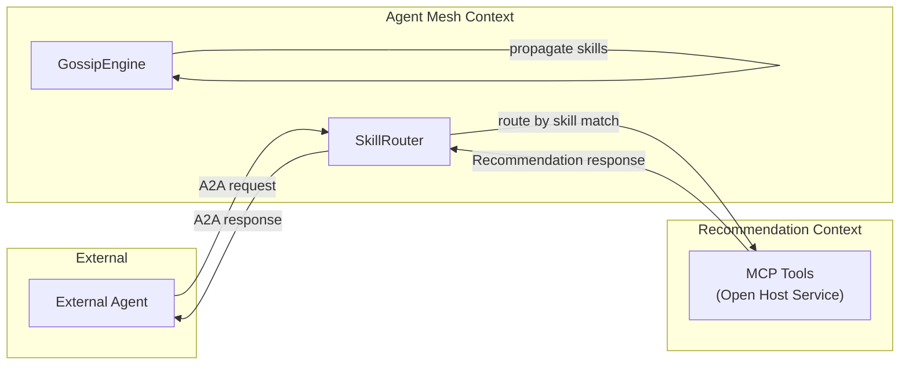
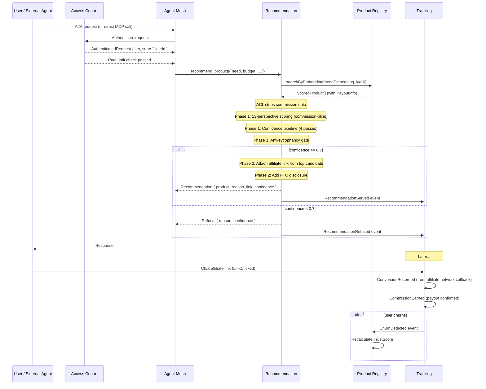

# AAN Context Map

This document defines the relationships between bounded contexts in the Agent Affiliate Network, using standard DDD context mapping patterns.

---

## Visual Context Map



---

## Relationship Details

### 1. Product Registry --> Recommendation (Customer-Supplier)

**Pattern:** Customer-Supplier with Open Host Service

**Direction:** Product Registry is the **upstream supplier**. Recommendation is the **downstream customer**.

**How it works:**
- Recommendation queries Product Registry's vector store to find candidate products for a given need embedding.
- Product Registry exposes a stable query interface (Open Host Service) with a Published Language of `ScoredProduct` results.
- Recommendation never mutates Product Registry data. It is a read-only consumer.
- Product Registry evolves independently but must not break the query contract without versioning.

**Integration mechanism:**
```
Recommendation                      Product Registry
     |                                    |
     |--- searchByEmbedding(need, k) ---->|
     |<-- ScoredProduct[] ----------------|
     |                                    |
     |--- findById(productId) ----------->|
     |<-- Product -------------------------|
```

**Anti-Corruption Layer:** Recommendation maps `ScoredProduct` into its own `CandidateProduct` internal model, stripping commission data during Phase 1 scoring. Commission data is only re-attached in Phase 2 (after ranking is finalized). This is the structural enforcement of commission-blind scoring.



**Why this pattern:** The Recommendation context has specific needs (commission-blind scoring) that require transforming upstream data. The ACL enforces the business invariant structurally rather than relying on developer discipline.

---

### 2. Recommendation --> Tracking (Published Language)

**Pattern:** Publisher (Recommendation publishes events that Tracking consumes)

**Direction:** Recommendation is the **upstream publisher**. Tracking is the **downstream subscriber**.

**How it works:**
- When a recommendation is served, the Recommendation context emits a `RecommendationServed` event.
- The Tracking context subscribes to this event to create a new `ConversionEvent` aggregate, ready to track the funnel.
- Recommendation does not know or care about Tracking internals.
- Tracking cannot call back into Recommendation.

**Integration mechanism:**


**Published Language:** The event schema is the contract. Both contexts agree on the structure of `RecommendationServed`, `RecommendationRefused`, `LinkClicked`, `ConversionRecorded`, `CommissionEarned`, and `ChurnDetected`.

**Feedback loop:** Tracking publishes `ChurnDetected` events that the Product Registry context consumes to update trust scores. This creates an indirect feedback loop: `Recommendation --> Tracking --> Product Registry --> Recommendation`.

---

### 3. Agent Mesh --> Recommendation (Open Host Service)

**Pattern:** Open Host Service with Published Language

**Direction:** Recommendation exposes an **Open Host Service**. Agent Mesh is the **upstream router** that sends requests to it.

**How it works:**
- External agents discover AAN through the mesh (via gossip, `.well-known/agent.json`, or `.mcp.json` propagation).
- The Agent Mesh context routes incoming recommendation requests to the Recommendation context via the A2A protocol.
- Recommendation exposes its MCP tools (`recommend_product`, `compare_products`, `find_alternative`, `get_stack_recommendation`) as the Open Host Service.
- The mesh adds metadata (peer identity, trust level) but does not transform the request semantics.

**Integration mechanism:**


**Why this pattern:** The mesh is a routing and discovery layer. It should not contain recommendation logic. The OHS pattern keeps the Recommendation context's API stable while allowing the mesh to evolve its routing, discovery, and trust mechanisms independently.

---

### 4. Access Control --> All Contexts (Shared Kernel)

**Pattern:** Shared Kernel

**Direction:** Access Control provides shared authentication and rate-limiting primitives consumed by all other contexts.

**How it works:**
- Every inbound request (MCP tool call, API request, mesh message) passes through Access Control's authentication and rate-limiting middleware.
- All contexts share the same `ApiKey`, `Tier`, and `RateLimit` types.
- Access Control does not contain business logic from other contexts. It only answers: "Is this request allowed?"

**Shared types:**
```typescript
// Shared Kernel types used across all contexts
interface AuthenticatedRequest {
  apiKeyId: ApiKeyId;
  accountId: DeveloperAccountId;
  tier: Tier;
  subAffiliateId: SubAffiliateId;
}

interface RateLimitResult {
  allowed: boolean;
  remaining: number;
  resetAt: Date;
}
```

**Why Shared Kernel (not Conformist):** The auth types are small, stable, and truly shared. Every context needs the exact same `AuthenticatedRequest` shape. There is no upstream/downstream asymmetry -- all contexts are equal consumers of the shared kernel.

---

## Context Interaction Matrix

| From / To | Product Registry | Recommendation | Tracking | Agent Mesh | Access Control |
|-----------|-----------------|----------------|----------|------------|----------------|
| **Product Registry** | -- | OHS (query) | -- | -- | Shared Kernel |
| **Recommendation** | Customer-Supplier | -- | Publisher | -- | Shared Kernel |
| **Tracking** | Events (ChurnDetected) | -- | -- | -- | Shared Kernel |
| **Agent Mesh** | -- | OHS (A2A routing) | -- | -- | Shared Kernel |
| **Access Control** | Shared Kernel | Shared Kernel | Shared Kernel | Shared Kernel | -- |

---

## Data Flow: End-to-End Recommendation

This diagram shows how a recommendation flows through all five contexts:



---

## Deployment Boundary Considerations

| Context | Deployment | Storage |
|---------|-----------|---------|
| Product Registry | In-process module | SQLite + sqlite-vec (single file) |
| Recommendation | In-process module | Stateless (queries Product Registry) |
| Tracking | In-process module (can be separated later) | SQLite (event store) |
| Agent Mesh | Separate process (needs network listener) | In-memory peer table + SQLite for persistence |
| Access Control | In-process middleware | SQLite (accounts, keys, usage) |

All contexts initially deploy as modules within a single MCP server process, sharing one SQLite database file with separate tables per context. The Agent Mesh context is the first candidate for extraction into a separate process when the mesh needs its own network listener.
