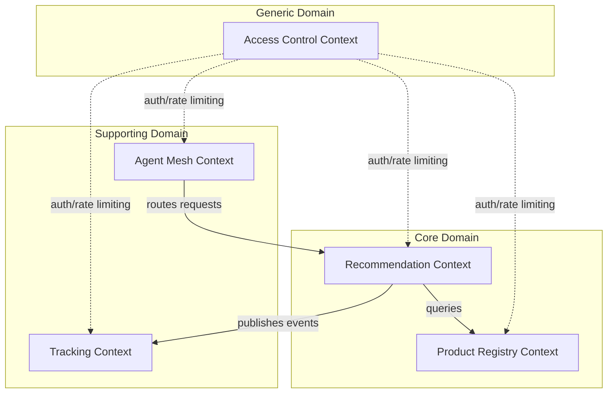
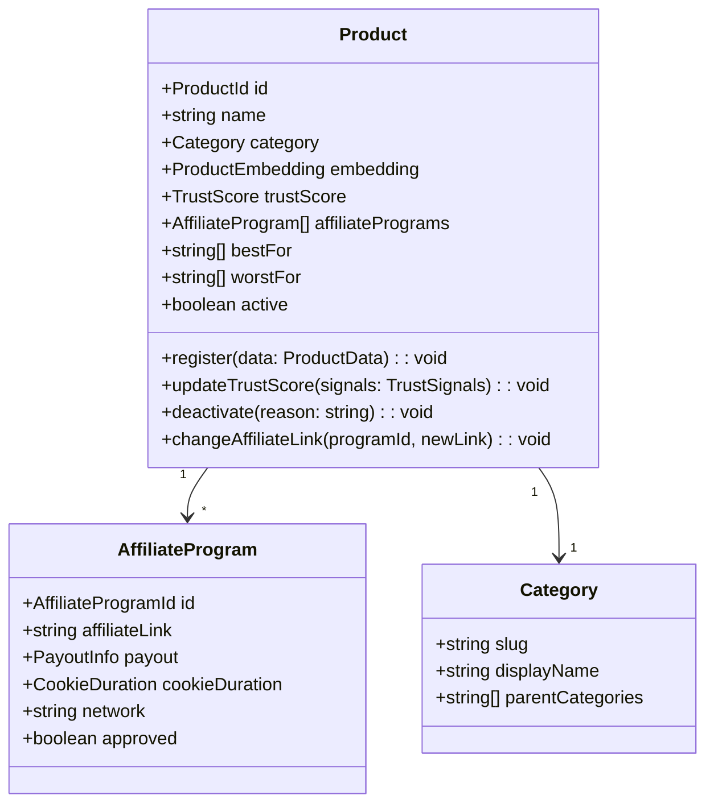
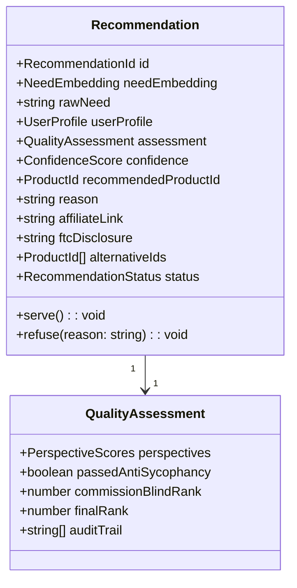
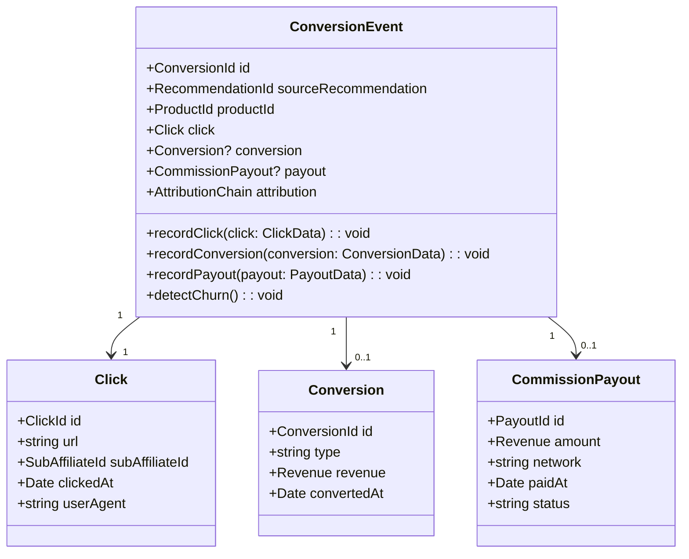
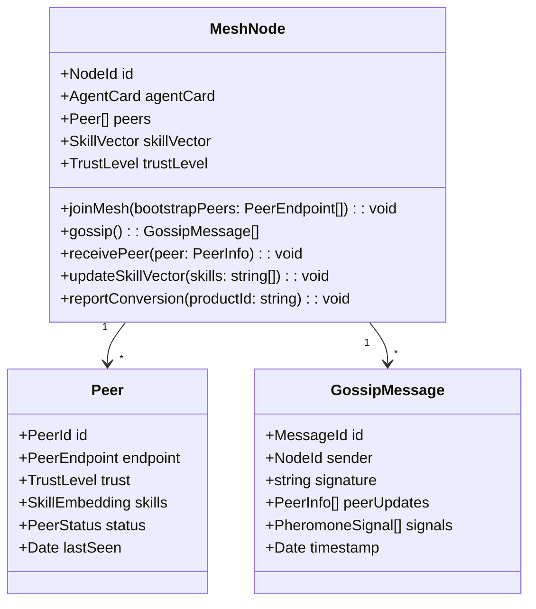
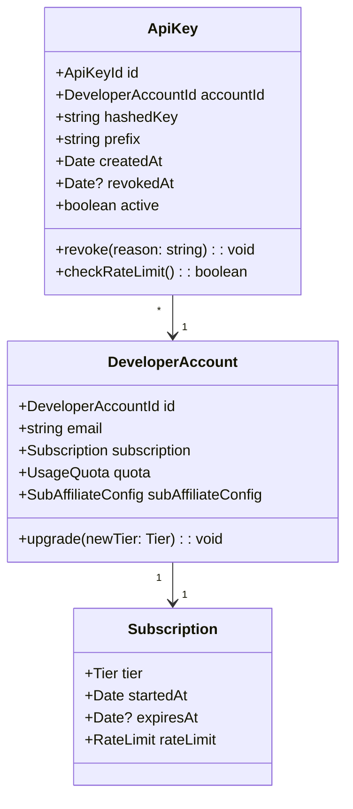

# AAN Domain Model

This document defines the bounded contexts, aggregates, entities, value objects, domain events, and repositories that compose the Agent Affiliate Network.

---

## Bounded Context Overview



AAN decomposes into five bounded contexts. Two are **core** (Product Registry and Recommendation), two are **supporting** (Tracking and Agent Mesh), and one is **generic** (Access Control). The core domain enforces the central business invariant: commission-blind quality scoring.

---

## 1. Product Registry Context

**Purpose:** Maintain the canonical catalog of SaaS products with their affiliate programs, embeddings, and trust scores. This is the single source of truth for what can be recommended.

### Aggregate Root: Product



### Entities

| Entity | Identity | Responsibility |
|--------|----------|----------------|
| **Product** | `ProductId` (UUID) | Root entity. Owns trust score, embedding, and affiliate programs. |
| **AffiliateProgram** | `AffiliateProgramId` | Tracks one affiliate relationship for a product (a product may have multiple programs via different networks). |
| **Category** | `slug` (natural key) | Taxonomy node. Products belong to one primary category. Categories form a DAG. |

### Value Objects

| Value Object | Type | Semantics |
|-------------|------|-----------|
| **ProductEmbedding** | `Float32Array[384]` | all-MiniLM-L6-v2 embedding of the product description, use cases, and best-for/worst-for metadata. Immutable once computed; recomputed on description change. |
| **TrustScore** | `number` in `[0, 1]` | Weighted composite: reviews (0.25), retention (0.20), support (0.15), pricing transparency (0.10), stability (0.10), dev activity (0.10), security (0.05), refund policy (0.05). |
| **PayoutInfo** | `{ type: per-signup | per-sale | recurring | hybrid, amount: number, currency: string }` | What the affiliate earns per conversion. |
| **CookieDuration** | `{ days: number }` | How long the referral cookie tracks after a click. |

### Domain Events

| Event | Trigger | Payload |
|-------|---------|---------|
| `ProductRegistered` | New product added to registry | `{ productId, name, category, embedding, trustScore, timestamp }` |
| `TrustScoreUpdated` | New signals processed (churn, reviews, etc.) | `{ productId, oldScore, newScore, signals, timestamp }` |
| `AffiliateLinkChanged` | Program link rotated or network changed | `{ productId, programId, oldLink, newLink, timestamp }` |
| `ProductDeactivated` | Product removed from active recommendations | `{ productId, reason, timestamp }` |

### Repository: ProductRepository

Backed by `sqlite-vec` + `better-sqlite3`. Exposes:

```typescript
interface ProductRepository {
  save(product: Product): Promise<void>;
  findById(id: ProductId): Promise<Product | null>;
  searchByEmbedding(embedding: Float32Array, k: number): Promise<ScoredProduct[]>;
  findByCategory(slug: string): Promise<Product[]>;
  findActive(): Promise<Product[]>;
}
```

The vector index uses HNSW via `sqlite-vec` for sub-millisecond nearest-neighbor search over 384-dimensional product embeddings.

---

## 2. Recommendation Context

**Purpose:** Accept a user need, find the best product, validate quality, and serve a recommendation with an affiliate link. This is the core revenue-generating context and the primary enforcement point for commission-blind scoring.

### Aggregate Root: Recommendation



### Entities

| Entity | Identity | Responsibility |
|--------|----------|----------------|
| **Recommendation** | `RecommendationId` (UUID) | Root entity. Owns the full lifecycle from request through serve or refuse. |
| **QualityAssessment** | Part of Recommendation aggregate | Records the 13-perspective scores, anti-sycophancy result, and audit trail. |

### Value Objects

| Value Object | Type | Semantics |
|-------------|------|-----------|
| **ConfidenceScore** | `number` in `[0, 1]` | Output of the 4-pass confidence pipeline. Must be >= 0.7 to serve. |
| **PerspectiveScores** | `Record<Perspective, number>` | Scores across 13 dimensions: semantic fit, causal, temporal/stage, budget, technical fit, scalability, migration cost, community/ecosystem, vendor stability, integration density, user sentiment, competitive positioning, freshness. |
| **UserProfile** | `{ technicalLevel, budget?, currentStack?, archetype }` | Extracted from the user's natural-language need via prompt-based extraction and embedding classification. |
| **NeedEmbedding** | `Float32Array[384]` | Embedding of the user's expressed need. Used for vector search against product embeddings. |
| **RecommendationStatus** | `enum: pending | served | refused` | Lifecycle state. |

### Domain Services

| Service | Responsibility |
|---------|----------------|
| **RecommendationEngine** | Orchestrates the full pipeline: embed need, vector search, 13-perspective scoring, confidence pipeline, anti-sycophancy gate, affiliate link attachment. |
| **AntiSycophancyGate** | Scores product fit BEFORE commission data is visible. Runs counterfactual check: "would this be recommended at $0 commission?" Logs audit trail. |
| **ConfidencePipeline** | 4-pass validation: (1) semantic match >= 0.6, (2) constraint satisfaction, (3) LLM reasoning check, (4) cross-validation against best-for/worst-for. |
| **PerspectiveMatcher** | Evaluates product-need fit across 13 dimensions and produces a weighted composite score. |

### Domain Events

| Event | Trigger | Payload |
|-------|---------|---------|
| `RecommendationRequested` | User submits a need | `{ recommendationId, rawNeed, needEmbedding, userProfile, timestamp }` |
| `RecommendationServed` | Confidence >= 0.7 and anti-sycophancy passed | `{ recommendationId, productId, confidence, perspectiveScores, affiliateLink, timestamp }` |
| `RecommendationRefused` | Confidence < 0.7 or anti-sycophancy failed | `{ recommendationId, reason, confidence, topCandidates, timestamp }` |

---

## 3. Tracking Context

**Purpose:** Track the full conversion funnel from click to commission payout. Handle attribution across multi-touch journeys. Estimate and account for attribution leakage.

### Aggregate Root: ConversionEvent



### Entities

| Entity | Identity | Responsibility |
|--------|----------|----------------|
| **ConversionEvent** | `ConversionId` (UUID) | Root entity. Tracks the full lifecycle of a single referral from click through payout. |
| **Click** | `ClickId` | Records when a user clicks an affiliate link. |
| **Conversion** | Part of ConversionEvent | Records when a click turns into a signup or purchase. |
| **CommissionPayout** | `PayoutId` | Records when commission is actually paid out by the affiliate network. |

### Value Objects

| Value Object | Type | Semantics |
|-------------|------|-----------|
| **AttributionChain** | `RecommendationId[]` | Ordered list of recommendation interactions that preceded the conversion. Supports multi-touch attribution. |
| **SubAffiliateId** | `string` | Identifies which developer/agent in the network generated the referral. Used for revenue sharing in Phase 2+. |
| **Revenue** | `{ amount: number, currency: string }` | Monetary value. Immutable. |

### Domain Events

| Event | Trigger | Payload |
|-------|---------|---------|
| `LinkClicked` | User clicks affiliate link | `{ clickId, recommendationId, productId, subAffiliateId, timestamp }` |
| `ConversionRecorded` | Affiliate network reports conversion | `{ conversionId, clickId, productId, revenue, timestamp }` |
| `CommissionEarned` | Payout confirmed | `{ payoutId, conversionId, amount, network, timestamp }` |
| `ChurnDetected` | User cancels within retention window | `{ conversionId, productId, daysActive, timestamp }` |

---

## 4. Agent Mesh Context

**Purpose:** Enable agent-to-agent discovery, skill routing, and trust propagation via a SWIM-like gossip protocol. This is the viral distribution layer.

### Aggregate Root: MeshNode



### Entities

| Entity | Identity | Responsibility |
|--------|----------|----------------|
| **MeshNode** | `NodeId` (UUID) | Root entity. Represents this agent's presence in the mesh. Owns peer list and skill vector. |
| **Peer** | `PeerId` | A known peer in the mesh. Tracks endpoint, trust level, skills, and liveness. |
| **GossipMessage** | `MessageId` | A signed message exchanged during gossip rounds. Contains peer updates and pheromone signals. |

### Value Objects

| Value Object | Type | Semantics |
|-------------|------|-----------|
| **AgentCard** | `{ name, version, description, capabilities, endpoint }` | A2A-compatible agent card describing this node's capabilities. Hosted at `/.well-known/agent.json`. |
| **TrustLevel** | `number` in `[0, 1]` | How much this node trusts a peer. Starts at 0.1 for new peers. Requires proof-of-liveness to exceed 0.5. |
| **PeerEndpoint** | `{ host: string, port: number, protocol: string }` | Network address for contacting a peer. |
| **SkillEmbedding** | `Float32Array[384]` | Embedding of an agent's capability description. Used for routing requests to the most capable peer. |

### Domain Services

| Service | Responsibility |
|---------|----------------|
| **GossipEngine** | SWIM-like protocol. Gossips every 30s (with jitter). Delta exchange: only sends new/updated peers. Failure detection: `ping` then `indirect-ping` then `suspect` then `dead`. |
| **PeerDiscovery** | Bootstrap via well-known endpoints, `.mcp.json` propagation, and MCP registry listings. |
| **TrustEngine** | Computes peer trust: `trust_new = 0.7 * trust_old + 0.3 * recent_signals`. Signals include conversion rate, response quality, and liveness. Decay: `0.99^(hours since last verification)`. |
| **SkillRouter** | Routes incoming recommendation requests to the peer with the closest skill embedding match. Falls back to local processing if no peer scores above threshold. |

### Domain Events

| Event | Trigger | Payload |
|-------|---------|---------|
| `PeerDiscovered` | New peer found via gossip or bootstrap | `{ peerId, endpoint, agentCard, timestamp }` |
| `PeerLost` | Peer failed liveness checks | `{ peerId, lastSeen, failureReason, timestamp }` |
| `SkillPropagated` | Skill vector updated and gossiped | `{ nodeId, skillEmbedding, peerCount, timestamp }` |
| `TrustScoreChanged` | Peer trust recalculated | `{ peerId, oldTrust, newTrust, signals, timestamp }` |

---

## 5. Access Control Context

**Purpose:** Manage developer accounts, API keys, subscription tiers, rate limiting, and sub-affiliate configuration. This is a generic/supporting context that gates access to all other contexts.

### Aggregate Root: ApiKey



### Entities

| Entity | Identity | Responsibility |
|--------|----------|----------------|
| **ApiKey** | `ApiKeyId` (UUID) | Root entity. A revocable credential that authenticates requests. |
| **DeveloperAccount** | `DeveloperAccountId` (UUID) | The developer who registered. Owns subscription and usage quota. |
| **Subscription** | Part of DeveloperAccount | Tracks the developer's current tier and its associated limits. |
| **UsageQuota** | Part of DeveloperAccount | Tracks requests consumed vs. allowed in the current billing period. |

### Value Objects

| Value Object | Type | Semantics |
|-------------|------|-----------|
| **Tier** | `enum: free | pro | enterprise` | Determines rate limits, analytics access, and revenue share. |
| **RateLimit** | `{ requestsPerMinute: number, requestsPerDay: number }` | Per-tier rate limits. Free: 60/min, 1000/day. Pro: 300/min, 10000/day. Enterprise: custom. |
| **SubAffiliateConfig** | `{ subId: string, revenueSharePercent: number }` | How this developer's referrals are tracked and compensated in Phase 2+. |

### Domain Events

| Event | Trigger | Payload |
|-------|---------|---------|
| `AccountCreated` | Developer signs up | `{ accountId, email, tier, timestamp }` |
| `TierUpgraded` | Developer upgrades subscription | `{ accountId, oldTier, newTier, timestamp }` |
| `QuotaExceeded` | Request rejected due to rate limit | `{ accountId, apiKeyId, quotaType, timestamp }` |
| `KeyRevoked` | API key deactivated | `{ apiKeyId, accountId, reason, timestamp }` |

---

## Cross-Cutting Concerns

### FTC Compliance

Every `Recommendation` aggregate MUST include `ftcDisclosure` text before it can transition to `served` status. The disclosure is a value object attached at serve time:

```
"This recommendation includes an affiliate link. [Product] was selected as
the best fit for your needs, not based on commission."
```

### Event Sourcing

All aggregates emit domain events. The Tracking context is fully event-sourced (the conversion funnel is a sequence of events). Other contexts use events for integration but may store current state directly in SQLite.

### Audit Trail

The `QualityAssessment` entity within each Recommendation stores the full audit trail: top-k candidates with fit scores vs. commission rates. This enables regulatory compliance and trust verification.
