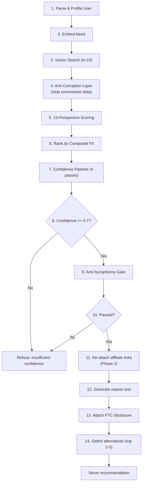
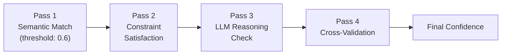
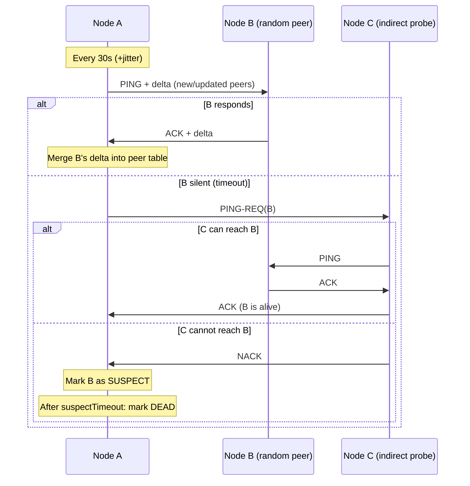
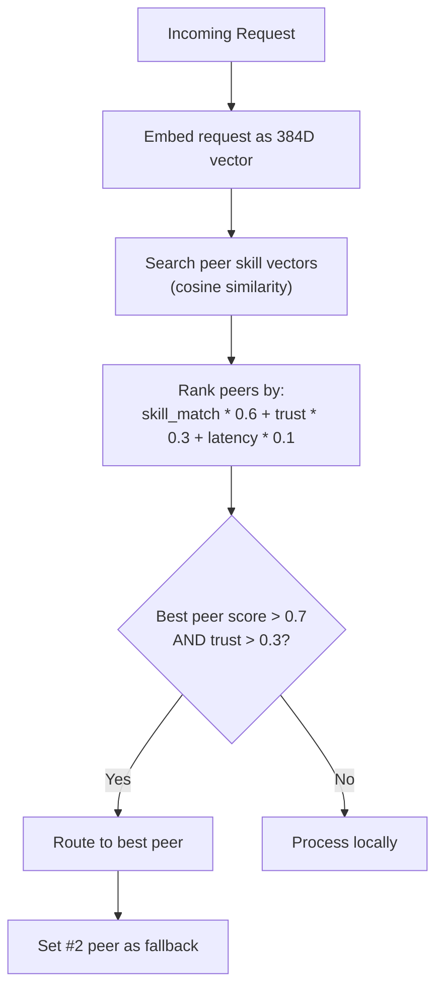
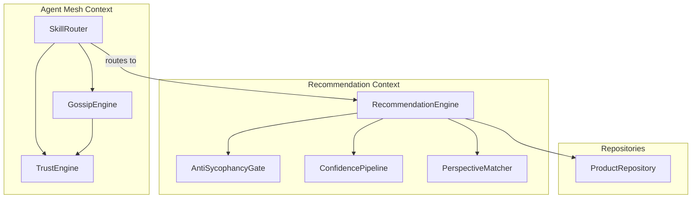

# AAN Domain Services

This document specifies the domain services that encapsulate business logic which does not naturally belong to a single aggregate. Each service operates within a single bounded context and coordinates across aggregates where needed.

---

## 1. RecommendationEngine

**Context:** Recommendation

**Responsibility:** Orchestrate the full recommendation pipeline from natural-language need to served recommendation with affiliate link.

### Interface

```typescript
interface RecommendationEngine {
  recommend(request: RecommendationRequest): Promise<RecommendationResult>;
}

interface RecommendationRequest {
  rawNeed: string;                  // "I need an email marketing tool"
  budget?: string;                  // "$50/mo"
  technicalLevel?: string;         // "beginner" | "intermediate" | "advanced"
  currentStack?: string[];          // ["nextjs", "vercel", "stripe"]
}

interface RecommendationResult {
  status: "served" | "refused";
  product?: {
    name: string;
    reason: string;                 // Why this product for this user
    link: string;                   // Affiliate link
    confidence: number;             // 0-1
    ftcDisclosure: string;
  };
  alternatives?: Array<{
    name: string;
    reason: string;
    link: string;
    confidence: number;
  }>;
  refusalReason?: string;           // If status is "refused"
}
```

### Pipeline Steps



### Step Details

**Step 1 -- Parse and Profile User:**
Extract explicit signals from the request (budget, technical level, current stack). Classify into an archetype (beginner-small-biz, senior-dev-scaling, etc.) using embedding-based classification. If the need is too vague, the engine should include a clarifying question in the response.

**Step 2 -- Embed Need:**
Convert `rawNeed` + extracted context into a 384D vector using all-MiniLM-L6-v2 via `@huggingface/transformers`. The embedding captures semantic meaning of the entire need context.

**Step 3 -- Vector Search:**
Query `ProductRepository.searchByEmbedding(needEmbedding, k=10)` to retrieve the 10 nearest products by cosine similarity. Only active products with at least one affiliate program are included.

**Step 4 -- Anti-Corruption Layer:**
Map `ScoredProduct[]` into `CandidateProduct[]`, stripping `PayoutInfo` and `affiliateLink` fields. From this point through Step 8, the pipeline operates with no awareness of commission data.

**Step 5 -- 13-Perspective Scoring:**
For each candidate, compute scores across all 13 perspectives. Each perspective produces a score in [0, 1]. The PerspectiveMatcher weights and combines these into a composite fit score.

**Step 6 -- Rank by Composite Fit:**
Sort candidates by composite fit score descending. This ranking is entirely commission-blind.

**Step 7 -- Confidence Pipeline:**
Run the top candidate through 4 validation passes (see ConfidencePipeline below).

**Step 8 -- Confidence Gate:**
If confidence < 0.7, refuse the recommendation. Log the refusal with the top candidates and their scores for audit.

**Step 9 -- Anti-Sycophancy Gate:**
Run the counterfactual check on the top candidate (see AntiSycophancyGate below).

**Step 10 -- Sycophancy Check:**
If the gate fails (product would not be recommended at $0 commission), refuse. This should be rare if the ACL is working correctly, but serves as a safety net.

**Step 11 -- Re-attach Links:**
Now that ranking is finalized, re-attach the affiliate link from the original `ScoredProduct` data. This is the only point where commission data re-enters the pipeline.

**Steps 12-14 -- Generate Output:**
Generate a human-readable reason explaining why this product fits this user's specific situation. Attach FTC disclosure. Select 2-3 alternatives from the remaining ranked candidates.

### Dependencies

| Dependency | Type | Purpose |
|-----------|------|---------|
| `ProductRepository` | Repository | Vector search and product retrieval |
| `PerspectiveMatcher` | Domain Service | 13-dimension scoring |
| `ConfidencePipeline` | Domain Service | 4-pass validation |
| `AntiSycophancyGate` | Domain Service | Commission-bias detection |
| Embedding model | Infrastructure | Need embedding generation |

---

## 2. AntiSycophancyGate

**Context:** Recommendation

**Responsibility:** Detect and reject recommendations that are driven by commission rather than genuine product-need fit. This is the single most important quality gate in the system.

### Interface

```typescript
interface AntiSycophancyGate {
  check(assessment: GateInput): GateResult;
}

interface GateInput {
  topCandidate: CandidateProduct;       // Commission-blind ranked #1
  allCandidates: CandidateProduct[];    // All candidates with fit scores
  commissionData: CommissionInfo[];     // Commission rates for all candidates
  userProfile: UserProfile;
}

interface GateResult {
  passed: boolean;
  reason: string;
  auditTrail: AuditEntry[];
}

interface AuditEntry {
  productId: string;
  fitScore: number;             // Commission-blind fit score
  commissionRate: number;       // What we'd earn
  commissionBlindRank: number;  // Rank without commission
  finalRank: number;            // Rank with commission (for audit only)
  flagged: boolean;             // True if commission would change ranking
}
```

### Algorithm

```
1. Rank all candidates by fit score (commission-blind). Record ranks.
2. Rank all candidates by (fit_score * 0.95 + commission_normalized * 0.05). Record ranks.
3. If the top candidate changes between rankings, FLAG.
4. Compute rank correlation between the two rankings.
5. If correlation < 0.8, FLAG (commission is distorting rankings too much).
6. Log full audit trail: every candidate with both rankings and scores.
7. Return passed=true only if no flags were raised.
```

The key insight: the gate does not just check the top candidate. It checks whether commission data would distort the entire ranking. Even a small systematic bias compounds over thousands of recommendations.

### Counterfactual Test

For the top candidate specifically, run:
- "Would this product be ranked #1 if its commission were $0?"
- "Would this product be ranked #1 if the #2 product had 10x the commission?"

If either answer is "no", the gate fails.

---

## 3. ConfidencePipeline

**Context:** Recommendation

**Responsibility:** Compute a confidence score through 4 sequential validation passes. Each pass can lower confidence. The final score must be >= 0.7 for a recommendation to be served.

### Interface

```typescript
interface ConfidencePipeline {
  evaluate(input: PipelineInput): PipelineResult;
}

interface PipelineInput {
  candidate: CandidateProduct;
  needEmbedding: Float32Array;
  userProfile: UserProfile;
  rawNeed: string;
}

interface PipelineResult {
  confidence: number;           // 0-1 final score
  passResults: PassResult[];    // Detail per pass
}

interface PassResult {
  pass: string;
  score: number;
  passed: boolean;
  detail: string;
}
```

### The 4 Passes



**Pass 1 -- Semantic Match (weight: 0.3):**
Cosine similarity between the need embedding and product embedding. Threshold: 0.6. If below 0.6, the product is semantically too far from the need and confidence drops sharply.

```
score = cosine_similarity(need_embedding, product_embedding)
if score < 0.6: confidence *= 0.3  // Severe penalty
```

**Pass 2 -- Constraint Satisfaction (weight: 0.25):**
Check hard constraints: budget (if specified), technical level compatibility, stack compatibility. Each unsatisfied constraint reduces confidence.

```
constraints_met = 0
constraints_total = count_applicable_constraints(userProfile)
score = constraints_met / constraints_total
if score < 0.5: confidence *= 0.5  // Half the candidates eliminated
```

**Pass 3 -- LLM Reasoning Check (weight: 0.25):**
Use the LLM to evaluate whether the recommendation reason is coherent and non-hedging. Detect patterns like "might work", "could be useful", "it depends" which indicate low actual confidence. This is an optional pass (skipped if no LLM available) that can only lower confidence, never raise it.

**Pass 4 -- Cross-Validation (weight: 0.2):**
Check the product's `bestFor` and `worstFor` metadata against the user profile. If the user's use case appears in `worstFor`, confidence drops significantly. If it appears in `bestFor`, confidence is confirmed.

```
if user_use_case in product.worstFor: confidence *= 0.2
if user_use_case in product.bestFor: confidence *= 1.1 (cap at 1.0)
```

### Final Score

```
final_confidence = base_similarity * pass1_modifier * pass2_modifier * pass3_modifier * pass4_modifier
```

---

## 4. PerspectiveMatcher

**Context:** Recommendation

**Responsibility:** Evaluate product-need fit across 13 independent dimensions and produce a weighted composite score.

### Interface

```typescript
interface PerspectiveMatcher {
  score(product: CandidateProduct, need: NeedContext): PerspectiveScores;
}

interface NeedContext {
  rawNeed: string;
  needEmbedding: Float32Array;
  userProfile: UserProfile;
}

type Perspective =
  | "semantic_fit"
  | "causal"
  | "temporal_stage"
  | "budget"
  | "technical_fit"
  | "scalability"
  | "migration_cost"
  | "community_ecosystem"
  | "vendor_stability"
  | "integration_density"
  | "user_sentiment"
  | "competitive_positioning"
  | "freshness";

type PerspectiveScores = Record<Perspective, number>; // Each 0-1
```

### Perspective Weights

| # | Perspective | Weight | How Scored |
|---|-----------|--------|------------|
| 1 | Semantic Fit | 0.15 | Cosine similarity between need and product embeddings |
| 2 | Causal | 0.10 | Does the product address the root cause of the need? |
| 3 | Temporal/Stage | 0.08 | Is the product right for the user's current growth stage? |
| 4 | Budget | 0.12 | Does the product fit the stated or inferred budget? |
| 5 | Technical Fit | 0.10 | Does the product match the user's technical level? |
| 6 | Scalability | 0.06 | Can the product grow with the user over 12-24 months? |
| 7 | Migration Cost | 0.08 | How hard is it to switch from their current tool? |
| 8 | Community/Ecosystem | 0.06 | Quality of docs, community, plugins, integrations |
| 9 | Vendor Stability | 0.05 | Financial health, funding, longevity signals |
| 10 | Integration Density | 0.07 | How well it connects with the user's existing stack |
| 11 | User Sentiment | 0.05 | Aggregate user satisfaction from reviews and signals |
| 12 | Competitive Positioning | 0.05 | How the product compares to alternatives for this specific case |
| 13 | Freshness | 0.03 | How recently the product data was verified |

**Total weight: 1.00**

### Composite Score

```
composite = sum(perspective_score[i] * weight[i] for i in 1..13)
```

The composite score is used for ranking candidates. It is NOT the confidence score (which is computed separately by the ConfidencePipeline).

---

## 5. GossipEngine

**Context:** Agent Mesh

**Responsibility:** Implement SWIM-like protocol for peer-to-peer discovery, state dissemination, and failure detection across the mesh.

### Interface

```typescript
interface GossipEngine {
  start(config: GossipConfig): void;
  stop(): void;
  getActivePeers(): Peer[];
  getPeerCount(): number;
}

interface GossipConfig {
  interval: number;           // Base interval in ms (default: 30000)
  jitter: number;             // Max jitter in ms (default: 5000)
  suspectTimeout: number;     // ms before suspect -> dead (default: 90000)
  maxDeltaSize: number;       // Max peers per gossip message (default: 10)
  bootstrapPeers: PeerEndpoint[];
}
```

### Protocol



### Gossip Round Detail

1. **Select target:** Pick a random peer from the active peer list. Prefer peers that have not been contacted recently.
2. **Compute delta:** Diff the current peer table against the last-gossiped state. Include only new or updated peers, up to `maxDeltaSize`.
3. **Send PING + delta:** The message is signed with this node's key. Include the delta and any pending pheromone signals.
4. **Receive ACK + delta:** Merge the remote delta into the local peer table. Update trust scores for newly-seen peers.
5. **Failure detection:** If no ACK within 2 seconds, initiate indirect probe via a third peer. If indirect probe also fails, mark target as `suspect`. After `suspectTimeout` (90s), mark as `dead`.

### Delta Exchange

Only send peers that have changed since the last gossip round with the target:
- New peers discovered from other gossip rounds
- Peers whose trust score changed
- Peers whose status changed (alive -> suspect -> dead)

This keeps gossip message size bounded and bandwidth proportional to change rate, not network size.

### Consistency

Gossip provides **eventual consistency** with probabilistic guarantees. A new peer is propagated to all nodes within O(log N) gossip rounds, where N is the number of peers. With a 30s interval and 100 peers, full propagation takes approximately 3-4 minutes.

---

## 6. TrustEngine

**Context:** Agent Mesh (also used by Product Registry for product trust scores)

**Responsibility:** Compute and maintain trust levels for peers and products based on observed behavior signals.

### Interface

```typescript
interface TrustEngine {
  computeTrust(current: number, signals: TrustSignals): number;
  applyDecay(current: number, hoursSinceVerification: number): number;
}

interface TrustSignals {
  conversionRate?: number;      // 0-1: what fraction of recommendations convert
  retentionRate?: number;       // 0-1: what fraction of conversions are retained
  responseQuality?: number;     // 0-1: quality of responses from this peer
  livenessVerified?: boolean;   // Did the peer pass proof-of-liveness?
  reviewScores?: number;        // 0-1: aggregate review quality
  supportQuality?: number;      // 0-1: support responsiveness and helpfulness
}
```

### Trust Computation

**Update formula (exponential moving average):**
```
trust_new = 0.7 * trust_old + 0.3 * weighted_signal_average
```

The 0.7/0.3 split means trust changes gradually. A single bad signal cannot destroy trust, but sustained bad signals will erode it. Conversely, trust takes time to build.

**Decay formula:**
```
trust_decayed = trust_current * 0.99^(hours_since_last_verification)
```

Trust decays exponentially when not reinforced. After 100 hours without verification, trust drops to ~36% of its current value. This prevents stale peers from retaining high trust.

**Constraints:**
- New peers start at trust = 0.1
- Trust CANNOT exceed 0.5 until proof-of-liveness is verified (invariant M2)
- Trust is clamped to [0, 1]

### Trust Signal Weights (for peers)

| Signal | Weight | Rationale |
|--------|--------|-----------|
| Conversion rate | 0.30 | Direct measure of recommendation quality |
| Retention rate | 0.25 | Conversions that stick are more valuable |
| Response quality | 0.20 | How well the peer handles requests |
| Liveness verified | 0.15 | Binary: has the peer proven it's alive? |
| Review scores | 0.10 | External validation |

### Churn Penalty

When `ChurnDetected` is received for a product:
```
churn_penalty = 0.15 * (1 - days_active / expected_retention_days)
trust_new = max(0, trust_current - churn_penalty)
```

Early churn (user cancels in days) incurs a larger penalty than late churn (user cancels after months). This discourages products that use aggressive sign-up incentives.

---

## 7. SkillRouter

**Context:** Agent Mesh

**Responsibility:** Route incoming recommendation requests to the peer in the mesh that is most capable of handling the specific request type.

### Interface

```typescript
interface SkillRouter {
  route(request: RecommendationRequest): RoutingDecision;
  updateRoutes(peer: Peer): void;
}

interface RoutingDecision {
  target: "local" | PeerId;
  confidence: number;           // How confident is the routing match
  fallback: PeerId | null;      // If target fails, try this peer
}
```

### Routing Algorithm



1. **Embed the request:** Convert the incoming need into a 384D vector.
2. **Search skill vectors:** Compute cosine similarity between the request embedding and each peer's skill embedding.
3. **Weighted ranking:** `score = skill_match * 0.6 + trust * 0.3 + (1 - normalized_latency) * 0.1`
4. **Decision:** If the best peer scores above 0.7 with trust above 0.3, route to that peer. Otherwise, process locally.
5. **Fallback:** If the primary target is unreachable, try the second-ranked peer before falling back to local processing.

### Pheromone Integration

When a conversion is reported (`reportConversion`), the SkillRouter deposits a pheromone signal for the product category. Future requests in that category will preferentially route to the peer that produced the conversion. Pheromone strength decays with `0.95^(hours_since_deposit)`.

---

## Service Dependency Map



The RecommendationEngine is the central orchestrator within the Recommendation context, depending on three other domain services. The SkillRouter in the Agent Mesh context depends on the TrustEngine and GossipEngine, and routes requests into the RecommendationEngine. No domain service crosses bounded context boundaries directly -- all cross-context communication flows through domain events or the defined integration patterns in the Context Map.
